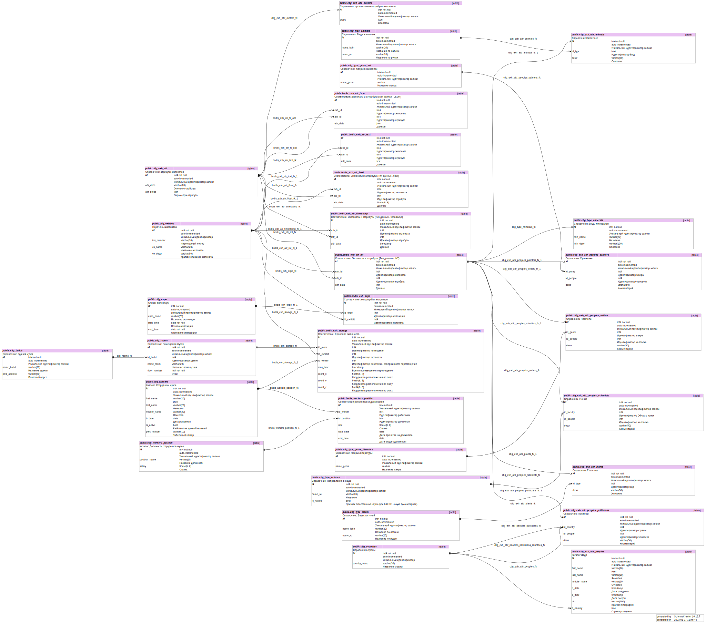

# Хабаровский краевой музей имени Н.И. Гродекова
- Адрес: г. Хабаровск, ул. Шевченко, 11
- Веб-сайт: https://hkm.ru/
- Дата посещения: 22.01.2023

## Описание структуры базы данных
На диаграмме ниже представлен визуальный обзор базы данных и связей между таблицами.

Структура имени таблиц была сформирована следующим образом: *типТаблицы*_*сущность*. Я выделил 2 типа: справочники (catalog - **ctlg**) и связки (bundles - **bndls**).

## Обзор таблиц и сценарии использования
Все экспонаты хранятся в таблице **ctlg_exhibits**, где указана только общая информация без каких либо свойств. Все возможные свойства, которые могут быть у экспонатов хранятся в **ctlg_exh_attr**, в колонке attr_props хранятся дополнительные атрибуты свойств в формате json (например, ссылка на таблицу справочник: для свойства "Художник" - ссылка на таблицу справочник с художниками **ctlg_exh_attr_peoples_painters**, также тип данных). Я выделил несколько основных параметров в отдельные справочники: люди (**ctlg_exh_attr_peoples**), художники(**ctlg_exh_attr_peoples_painters**), писатели (**ctlg_exh_attr_peoples_writers**), политики (**ctlg_exh_attr_peoples_politicians**), ученые (**ctlg_exh_attr_peoples_scientists**), животные (**ctlg_exh_attr_animals**), растения (**ctlg_exh_attr_plants**), минералы (**ctlg_type_minerals**). Остальные справочники будут хранится в виде массива в формате json в таблице **ctlg_exh_attr_custom**. В качестве хранения параметров атрибутов экспонатов я определил 4 основных типов данных и каждый хранится в отдельной таблице: integer (**bndls_exh_atr_int**), float (**bndls_exh_atr_float**), text (**bndls_exh_atr_text**), timestamp (**bndls_exh_atr_timestamp**), для прочих типов данных подготовлена таблица для хранения произвольного набора данных в формате json (**bndls_exh_atr_json**).

Данные о месте размещения экспоната предполагаю хранить по примеру географических координат: каждое помещение должно быть размечено по 3м координатам: длина, ширина, высота (в метрах), и, соответственно каждому экспонату присвоена (приблизительно) своя координата. Например, при координате длины(x) 0,0 м. и высоты (z) равной 2,0 м., мы понимаем, что это скорее всего картина и она висит на стене. Эти данные хранятся в связке **bndls_exh_storage**. Также в этой таблице содержатся данные о работнике, который совершил перемещение экспоната и дату, когда он это произвел.

С помощью данной модели возможны следующие сценарии:
- хранение всех экспонатов, с присвоением любых атрибутов;
- сортировка экспонатов по любому из атрибутов (как, например, по жанру картины, так и весу экспоната или материала изготовления и т.д.);
- организация экспозиций с добавлением необходимых экспонатов и выдачу заданию музейным работникам о перемещении экспонатов;
- хранение истории о перемещении каждого экспоната с привязкой ко времени и работнику;
- учет рабочего персонала музея, с формированием ФОТ.